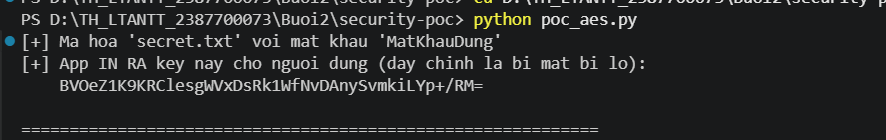
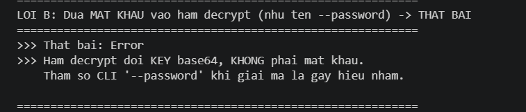

# crypto-toolkit — Phân tích điểm yếu bảo mật

Thư viện mật mã (`securecrypto`) gồm mã hoá AES-256-GCM, ký RSA, băm Argon2, kèm CLI, GUI (Tkinter) và API (Flask).
Tài liệu này mô tả **vị trí lỗ hổng → cách khai thác → kết quả khai thác**.

> Môi trường kiểm thử: Windows 11 · Python 3.13 · Flask 3.1.3 / Werkzeug 3.1.9.
> Rà soát phục vụ mục đích học tập trên mã nguồn của chính người thực hiện.

---

## A. Quá trình chạy thử dự án

Các ảnh trong [`anh/`](anh/) là **chạy thử chức năng bình thường** của dự án (theo hướng dẫn lab), dùng làm ngữ cảnh:

| | |
|---|---|
| Unit test (6 passed) |  |
| CLI mã hoá |  |
| CLI giải mã |  |
| GUI (Tkinter) |  |
| API `/encrypt` (Postman) |  |
| API `/decrypt` (Postman) |  |

---

## B. Các điểm yếu bảo mật

### Lỗ hổng 1 — Lộ khoá mã hoá (Key Exposure)

**Vị trí:** [`securecrypto/aes_utils.py:27`](securecrypto/aes_utils.py#L27) — `encrypt_file_aes` trả thẳng khoá AES ra ngoài (in ra CLI, trả JSON API, hiện trên GUI):

```python
return base64.b64encode(key).decode()
```

**Cách khai thác:** khoá bí mật bị chính ứng dụng hiển thị. Kẻ tấn công đọc log terminal / response API / màn hình GUI là có khoá, rồi giải mã file mà **không cần mật khẩu**.

**Kết quả khai thác:**



**Khắc phục:** không bao giờ trả/in khoá; giải mã nhận mật khẩu, tự đọc salt trong file rồi `derive_key_from_password` lại.

---

### Lỗ hổng 2 — Giải mã dùng khoá thay vì mật khẩu, salt bị bỏ

**Vị trí:** [`securecrypto/aes_utils.py:32`](securecrypto/aes_utils.py#L32) — đọc salt nhưng không dùng, nhận thẳng khoá:

```python
salt = raw[:16]                      # đọc lên rồi bỏ, không dùng
key  = base64.b64decode(key_base64)  # đối số "password" thực chất là KEY
```

**Cách khai thác:** đưa **mật khẩu** vào hàm giải mã (đúng như tên tham số `--password` gợi ý) để kiểm chứng.

**Kết quả khai thác:** thất bại, vì hàm đòi khoá base64 chứ không phải mật khẩu; salt đọc lên bị bỏ qua.



**Khắc phục:** hàm giải mã phải derive lại khoá từ mật khẩu + salt đọc từ file.

---

### Lỗ hổng 3 — API lộ đường dẫn máy chủ & giữ lại bản rõ

**Vị trí:** [`securecrypto/api.py:24`](securecrypto/api.py#L24) — trả nguyên đường dẫn tuyệt đối và không xoá file sau xử lý.

**Cách khai thác:** gọi `/decrypt`, đọc trường `output` trong JSON trả về.

**Kết quả:** lộ cấu trúc thư mục thật của máy chủ (`D:\TH_LTANTT_2387700073\...\upload\...`); file gốc và file `.dec` vẫn nằm lại trong `securecrypto/upload/`. Xem ảnh API `/decrypt` ở mục A (trường `output`).

**Khắc phục:** chỉ trả tên file/kết quả; xoá bản rõ sau khi xử lý.

---

### Lỗ hổng 4 — Path traversal khi upload (tiềm ẩn)

**Vị trí:** [`securecrypto/api.py:15`](securecrypto/api.py#L15) — `os.path.join(FILES_DIR, f.filename)` dùng thẳng tên client gửi (CWE-22).

**Cách khai thác:** gửi `filename=..\..\evil.txt` để cố ghi file ra ngoài `upload/`.

**Kết quả:** ❌ **Không khai thác được** trên Werkzeug 3.1.9 — framework tự lược bỏ dấu phân cách, file luôn bị giữ trong `upload/`. Đây là **lỗi tiềm ẩn**, không phải lỗ hổng khai thác thành công.

**Khắc phục (phòng thủ chiều sâu):** dùng `secure_filename()` và kiểm tra `os.path.commonpath` nằm trong `FILES_DIR`.

---

## C. Tổng hợp

| # | Lỗ hổng | Vị trí | Trạng thái |
|---|---|---|---|
| 1 | Lộ khoá mã hoá | aes_utils.py:27 | ✅ Khai thác được |
| 2 | Giải mã dùng khoá, bỏ salt | aes_utils.py:32 | ✅ Khai thác được |
| 3 | Lộ đường dẫn server, giữ bản rõ | api.py:24 | ✅ Khai thác được |
| 4 | Path traversal upload | api.py:15 | ⚠️ Tiềm ẩn (framework chặn) |

Script tái hiện: [`../security-poc/poc_aes.py`](../security-poc/poc_aes.py).
