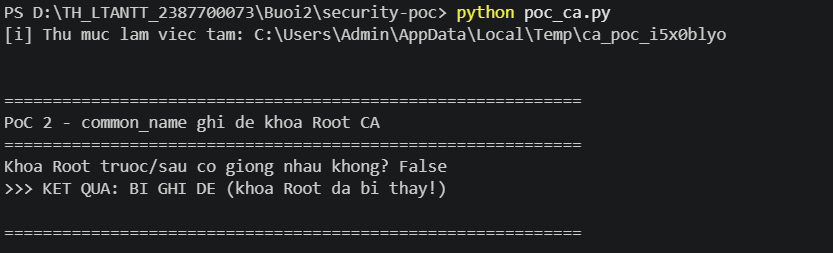
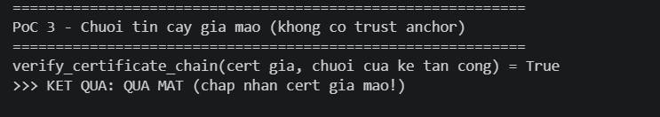
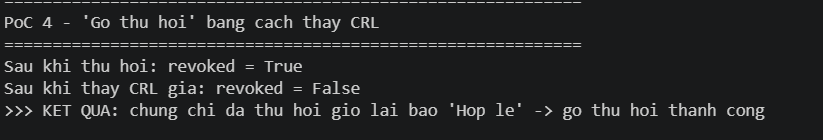

# mini-ca — Phân tích điểm yếu bảo mật


### Lỗ hổng 1 — Khoá riêng (kể cả Root CA) lưu không mã hoá

**Vị trí:** [`ca_utils.py:21`](ca_utils.py#L21) — `save_key` ghi khoá bằng `NoEncryption()`:

```python
encryption_algorithm=serialization.NoEncryption()   # không mật khẩu bảo vệ
```

**Cách khai thác:** chỉ cần đọc được file trong `certs/` là có ngay khoá riêng PEM thuần. Khoá Root (`root_ca_key.pem`) nằm chung thư mục với khoá người dùng — thấy rõ ở ảnh `certs/` mục A.

**Kết quả:** lộ `root_ca_key.pem` = chiếm quyền toàn bộ PKI, tự ký được mọi chứng chỉ.


---

### Lỗ hổng 2 — `common_name` điều khiển tên file → ghi đè khoá CA

**Vị trí:** [`ca_utils.py:109`](ca_utils.py#L109) — tên file lấy trực tiếp từ `common_name`, chỉ thay dấu cách (CWE-73):

```python
filename_prefix = subject_info.get("common_name", "entity").replace(" ", "_")
save_key(key, f"{filename_prefix}_key.pem")   # không lọc tên trùng / ../
```

**Cách khai thác:** phát hành chứng chỉ end-entity với `common_name = "root_ca"`. Tên file thành `root_ca_key.pem`, trùng file khoá Root CA và ghi đè lên nó.

**Kết quả khai thác:** khoá Root bị thay — chỉ cần quyền phát hành cert thường là phá được khoá gốc.




---

### Lỗ hổng 3 — Xác thực chuỗi không có mỏ neo tin cậy

**Vị trí:** [`ca_utils.py:115`](ca_utils.py#L115) — `verify_certificate_chain` chỉ kiểm chữ ký của chuỗi được truyền vào, không đối chiếu Root tin cậy, không kiểm hạn/thu hồi.

**Cách khai thác:** kẻ tấn công tạo Root CA riêng, tự cấp chứng chỉ cho `bank.example.com`, rồi nộp kèm **chuỗi của chính họ**.

**Kết quả khai thác:** hàm trả `True` cho chứng chỉ giả mạo → chấp nhận cert giả bất kỳ.




---

### Lỗ hổng 4 — CRL không kiểm tra chữ ký

**Vị trí:** [`revoke_utils.py:69`](revoke_utils.py#L69) — `check_revocation_status` đọc `ca_crl.pem` mà không verify chữ ký CRL, cũng không xem `next_update`:

```python
crl = x509.load_pem_x509_crl(f.read())   # không is_signature_valid()
```

**Cách khai thác:** thu hồi một chứng chỉ, sau đó thay `certs/ca_crl.pem` bằng một CRL rỗng ký bằng khoá bất kỳ.

**Kết quả khai thác:** chứng chỉ đã thu hồi lại được báo hợp lệ (`revoked = True → False`) — cơ chế thu hồi bị vô hiệu hoá.



---

Script tái hiện: [`../security-poc/poc_ca.py`](../security-poc/poc_ca.py) — chạy trong thư mục tạm, không tác động tới `certs/` thật.
